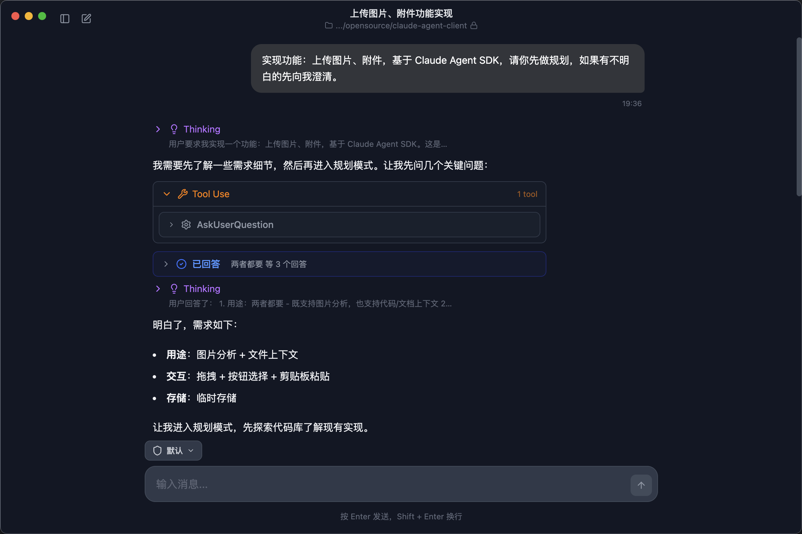

<div align="center">
  
  # Amon Agent

  <p>Amon 是一个基于 Claude Agent SDK + Electron 构建的桌面 Agent 应用，可以作为 Claude Code 的可视化图形界面。目标是成为一个通用的 Agent 客户端。</p>

  <a href="https://www.gnu.org/licenses/agpl-3.0"></a>
  <a href="https://www.electronjs.org/"></a>
  <a href="https://react.dev/"></a>
  <a href="https://www.typescriptlang.org/"></a>
  <a href="https://github.com/anthropics/claude-code"></a>

  
</div>

## 项目简介

Amon 是一个基于 [Claude Agent SDK](https://platform.claude.com/docs/en/agent-sdk/overview) 构建的桌面应用，可以为 Claude Code 提供可视化的图形界面。

做这个项目有几个目的：

- **学习 Claude Agent SDK**：通过实际项目学习如何使用 Claude Agent SDK 开发 Agent 应用。如果你也对 Agent 开发感兴趣，这个项目可以作为学习参考。

- **Claude Code 的 GUI 替代方案**：Claude Code 是一个强大的命令行的 Vibe Coding 工具，但有时候图形界面会更直观。Amon 基于相同的 Claude Agent SDK 构建，完全兼容 Claude Code 的能力。

- **通用 Agent 客户端（长期目标）**：未来希望将 Amon 打造成一个通用的 Agent 客户端，作为每个人的本地 Agent 助手，不限于 Coding 能力。

> [!NOTE]
> 项目正在早期开发阶段，功能可能会有较大变动。欢迎试用和反馈！

## 功能特性

### Agent 能力

基于 Claude Agent SDK，支持完整的工具集：

- **文件操作** — 读取、创建、编辑文件
- **代码编辑** — 智能定位并修改代码
- **命令执行** — 运行 Bash 命令
- **Web 搜索** — 获取互联网信息
- **任务规划** — 自主分解复杂任务
- **Skills** — 通过 Skills 扩展能力

### 权限控制

| 模式 | 说明 |
|------|------|
| 默认 | 每次工具调用都需要确认 |
| 自动编辑 | 自动批准文件编辑，其他操作需确认 |
| 不询问 | 拒绝未预先允许的工具调用 |
| 绕过权限 | 完全自动化执行（谨慎使用） |

### 桌面体验

- 跨平台：macOS、Windows、Linux
- 流式响应，实时显示思考过程
- 多工作空间管理
- 深色/浅色主题

### Skills 扩展

Skills 可以扩展 Agent 的能力，内置了 PDF 处理、算法艺术、前端设计等技能，可以一键安装。

也会自动探测识别到已安装的 Skills：

- **系统级**: `~/.claude/skills/<skill-name>/SKILL.md`
- **项目级**: `<project>/.claude/skills/<skill-name>/SKILL.md`

## 安装

> 目前暂未提供预构建的安装包，需要本地克隆源码运行。

### 1. 安装 Claude Code

Amon 使用 Claude Code 作为运行时，必须先安装：

```bash
npm install -g @anthropic-ai/claude-code
```

### 2. 配置 API Key

API Key 需要在系统环境变量中配置，或者通过 Claude Code 进行配置。

推荐使用 [cc-switch](https://github.com/farion1231/cc-switch) 来管理 API Key，可以方便地切换不同的配置。

或者手动配置环境变量：

```bash
# macOS/Linux
export ANTHROPIC_BASE_URL="your-api-url"
export ANTHROPIC_API_KEY="your-api-key"

# Windows PowerShell
$env:ANTHROPIC_BASE_URL="your-api-url"
$env:ANTHROPIC_API_KEY="your-api-key"
```

### 3. 运行项目

```bash
git clone https://github.com/liruifengv/amon-agent.git
cd amon-agent
bun install
bun start
```

构建安装包：

```bash
bun run make
```

## 技术栈

- **Electron**：跨平台桌面应用框架
- **React**：前端 UI 框架
- **TypeScript**：静态类型检查
- **Claude Agent SDK**：Agent 能力支持
- **Tailwind CSS**：样式设计
- **Zod**：数据验证
- **Zustand**：状态管理
- **Vite**：构建工具
- **Shadcn/ui**：组件库

## 开源协议

[AGPL-3.0](LICENSE)
