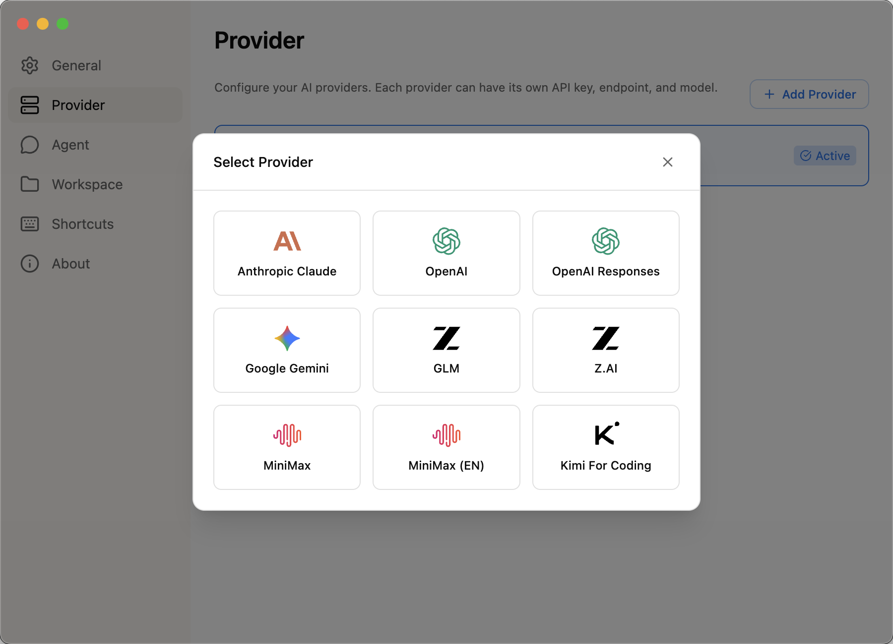

<div align="center">
  
  <h1>Amon Coworker</h1>
  <p>Your AI coworker running on your desktop</p>

  <a href="./README.zh-CN.md">中文</a> | English

  <br/>
  <br/>

  <a href="https://www.gnu.org/licenses/agpl-3.0"></a>
  <a href="https://www.electronjs.org/"></a>
  <a href="https://react.dev/"></a>
  <a href="https://www.typescriptlang.org/"></a>
  <a href="https://zod.dev/"></a>
</div>

## About Amon

Amon is an intelligent AI coworker that runs locally on your desktop. It doesn't just chat with you — it actually helps you get work done: writing code, executing commands, searching for information, and managing files.

Amon features a custom three-layer agent architecture with a provider-agnostic AI streaming layer, supporting multiple LLM providers including Anthropic Claude, OpenAI, Google Gemini, and any API-compatible providers out of the box.

## Feature Overview

Let's take a look at Amon's features through screenshots.


Amon can think through your messages, execute tool calls, and complete your tasks.


Amon has a plan mode that creates a TODO task list first, then executes according to the plan.


Amon supports both dark and light theme modes.


Amon can display file modification diffs.


Amon supports sending image messages.



Amon allows you to add multiple API providers with built-in support for Anthropic Claude, OpenAI, Google Gemini, and API-compatible providers (GLM, MiniMax, Kimi, etc.).


Amon lets you configure Agent execution permissions with different permission levels.

You can customize the system prompt.

If you have Claude Code installed with an API Key configured, you can enable `Claude Code Mode` for enhanced coding capabilities.

With Claude Code Mode enabled, Amon will use Claude Code's global settings and system prompts, and automatically load global Skills, etc.

Once enabled, you can use Amon as a visual client for Claude Code.


Amon works on a per-workspace (folder) basis. You can set up multiple workspaces. Default workspace: `~/.amon/workspaces`


Amon supports Agent Skills — you can install Skills to add specialized capabilities to Amon.

Several recommended skills are built in, including:
- PDF Tools — Text extraction, form filling, document merging
- Frontend Design — Create beautiful web interfaces and components
- Algorithmic Art — Generate creative artwork with p5.js
- MCP Builder — Develop MCP servers
- Docs Coauthoring — Collaborative document editing
- Web Artifacts Builder — Create interactive web components
- And more (16 built-in skills in total)

## Getting Started

### Installation

Visit the [Releases](https://github.com/liruifengv/amon-agent/releases) page to download the installer for your platform.

#### Note for macOS Users

Since the app is not Apple-signed, macOS may block it from running. After downloading, run the following command in the terminal to remove the quarantine attribute:

```bash
xattr -cr /Applications/Amon.app
```

### Configuration

Amon offers two usage modes — choose based on your needs:

#### Option 1: Standalone Mode (Recommended for New Users)

After first launch, follow these steps to configure:

1. **Configure AI Provider**

   Go to `Settings` → `Providers`, create and enable the AI provider you want to use

2. **Create a Workspace**

   Go to `Settings` → `Workspaces`, create a new workspace and select a local folder as the project root

   Default workspace: `~/.amon/workspaces`

3. **Start Using**

   Return to the main screen, click `New Session`, select a workspace and start chatting

#### Option 2: Claude Code Mode (Recommended for Development)

If you have [Claude Code](https://github.com/anthropics/claude-code) installed with an API Key configured, you can enable Claude Code Mode for enhanced coding capabilities.

**How to enable**: `Settings` → `Agent` → Enable `Claude Code Mode`

**Mode Comparison**:

| Feature | Standalone Mode | Claude Code Mode |
|---------|----------------|-----------------|
| Prompts | Amon default prompts | Inherits Claude Code prompts |
| API Config | Manual configuration | Prioritizes Claude Code global config |
| Skills | Local Skills | Shares Claude Code installed Skills |
| Tool Permissions | Amon permission settings | Claude Code permission settings |
| Use Case | General chat and tasks | Code development and engineering tasks |

## Development Guide

### Prerequisites

- Node.js 18+ or Bun 1.0+
- macOS / Windows / Linux

### Development Commands

```bash
bun install            # Install dependencies
bun start              # Start dev server (with hot reload)
bun run lint           # Lint code
bun run typecheck      # Type check
```

### Build and Package

```bash
bun run download:binaries  # Download runtime binaries (bun, uv)
bun run package            # Create app package (no installer)
bun run make               # Create platform installers
```

### Project Structure

```
amon-agent/
├── src/
│   ├── ai/            # Provider-agnostic AI streaming layer
│   │   ├── providers/ # Built-in providers (Anthropic, OpenAI, Google)
│   │   └── utils/     # Event stream, JSON parsing, overflow detection
│   ├── agent/         # Framework-agnostic Agent class and loop
│   ├── main/          # Electron main process
│   │   ├── agent/     # Electron-specific agent integration
│   │   ├── ipc/       # IPC communication handlers
│   │   ├── store/     # State management and persistence
│   │   ├── tools/     # 8 built-in tools (bash, read, write, edit, etc.)
│   │   ├── skills/    # Skill loading and parsing
│   │   └── workspace/ # User file loading (AGENTS.md, SOUL.md)
│   ├── renderer/      # React renderer process
│   │   ├── components/# UI components
│   │   └── store/     # Zustand state management
│   ├── preload/       # contextBridge IPC bridge
│   ├── shared/        # Shared types, schemas, constants
│   └── locales/       # i18n files (en, zh)
├── resources/
│   ├── skills/        # 16 built-in Skills
│   ├── icons/         # App icons
│   └── [bun, uv]     # Runtime binaries
└── forge.config.ts    # Electron Forge configuration
```

## Architecture

Amon adopts a three-layer agent architecture, with each layer cleanly decoupled:

```
┌─────────────────────────────────────────────┐
│  src/ai/        AI Streaming Layer          │  Provider-agnostic, multi-provider
│                 (Anthropic / OpenAI / Google)│  Unified streaming event model
├─────────────────────────────────────────────┤
│  src/agent/     Agent Core                  │  Framework-agnostic Agent + Loop
│                 (State, Tools, Messages)     │  Dual-loop: tool exec + follow-up
├─────────────────────────────────────────────┤
│  src/main/agent/ Electron Integration       │  AgentService, EventAdapter
│                 (IPC, Push, Persistence)     │  Session management, system prompt
└─────────────────────────────────────────────┘
```

- **AI Layer** (`src/ai/`) — Provider-agnostic streaming abstraction. Global provider registry with 4 built-in providers. Normalizes all responses into a unified `AssistantMessageEvent` stream.
- **Agent Layer** (`src/agent/`) — Framework-agnostic `Agent` class. Dual-loop architecture: inner loop (LLM call -> tool execution -> steering check), outer loop (follow-up queue -> repeat). Tool input validated with Zod schemas.
- **Integration Layer** (`src/main/agent/`) — Wires Agent into Electron. `AgentService` manages per-session agents. `EventAdapter` bridges agent events to session store mutations and push notifications.

## Tech Stack

<table>
<tr>
<td valign="top" width="50%">

**Core Frameworks**
- Electron — Cross-platform desktop apps
- React 19 — UI framework
- TypeScript — Type safety

**AI Layer**
- Custom provider-agnostic streaming layer
- Anthropic SDK / OpenAI SDK / Google GenAI SDK
- Dual-loop agent architecture (tool execution + follow-up)

**Frontend**
- Tailwind CSS + Shadcn/ui — UI design
- Zustand — State management
- Streamdown — Streaming Markdown rendering

</td>
<td valign="top" width="50%">

**Build Tools**
- Vite — Lightning-fast builds
- Electron Forge — Packaging and distribution
- Bun — Runtime and package manager

**Data & Validation**
- Zod v4 — Runtime type validation and tool input schemas
- Shiki — Code syntax highlighting
- i18next — Internationalization (en, zh)

</td>
</tr>
</table>

## License

This project is open-sourced under the [AGPL-3.0](LICENSE) license.

---

<div align="center">
  <sub>Built with ❤️ by <a href="https://github.com/liruifengv">@liruifengv</a></sub>
</div>
